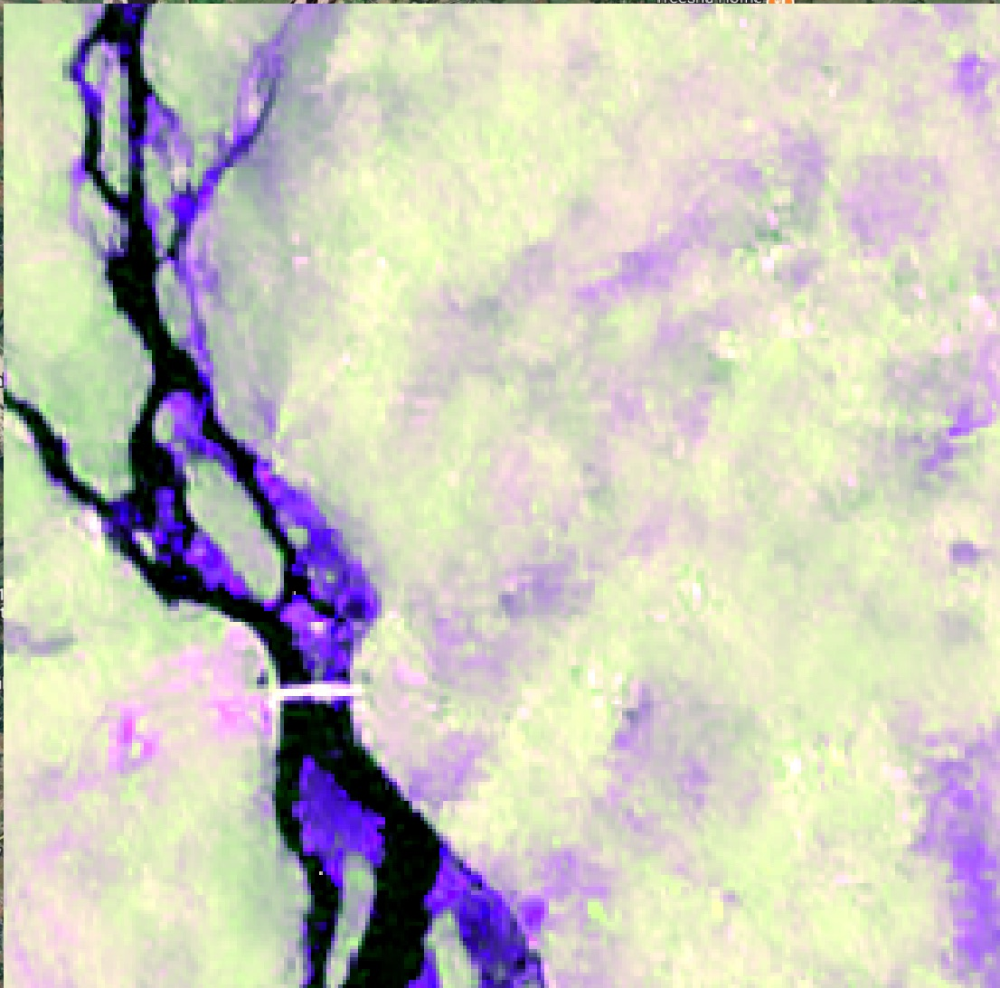
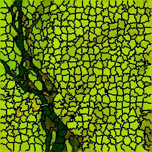
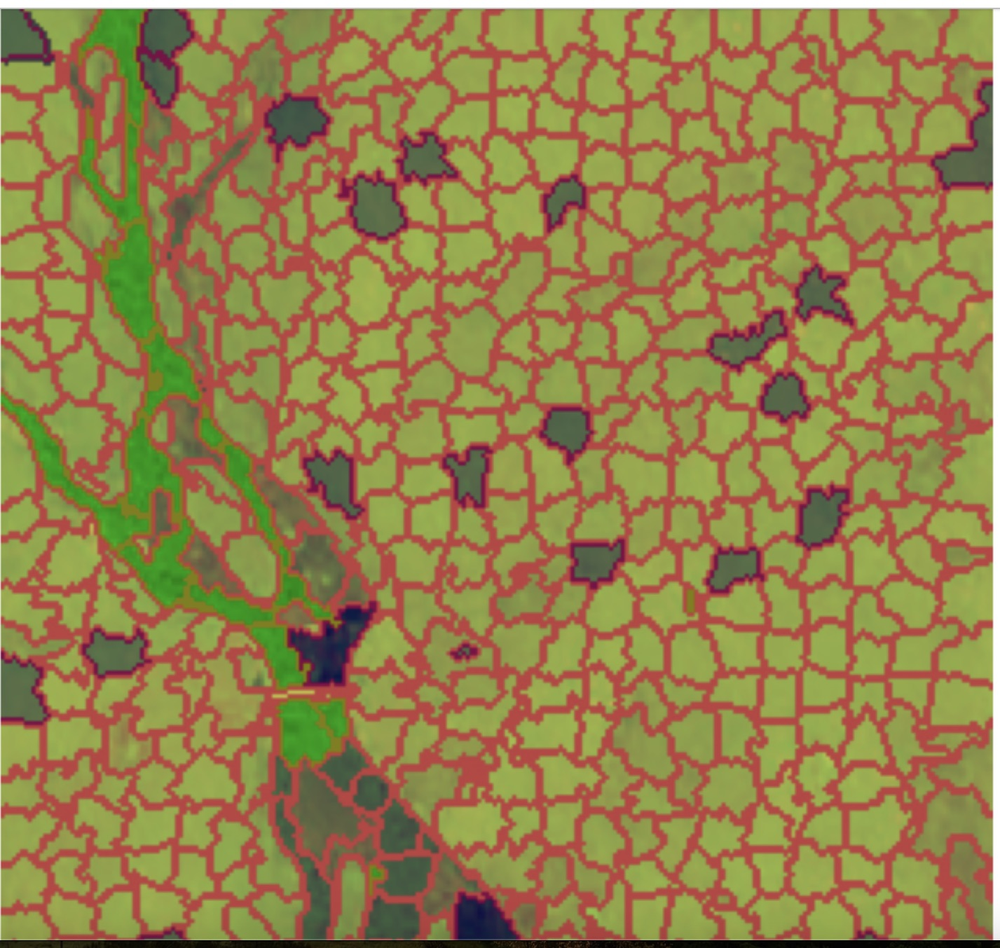
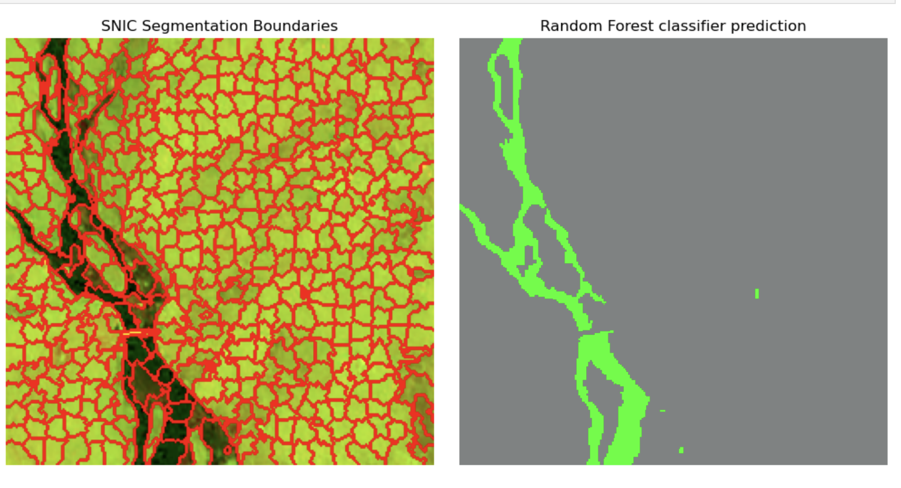

# sar-superpixel-classification

This project implements an object-based image analysis (OBIA) workflow for SAR image segmentation and classification using superpixels and Random Forest (RF) classification. The goal is to distinguish water and non-water regions in synthetic aperture radar (SAR) imagery.

## Usage
You can either clone this GitHub repository or use it directly online via Binder using the link below:

## Overview

- **Input Data**: Multiband SAR .tif image (e.g., VV, VH)
- **Segmentation**: Superpixel generation using SNIC (Simple Non-Iterative Clustering)
- **Feature Extraction**: Mean, standard deviation, texture (entropy) per segment
- **Classification**: Random Forest classifier for water vs non-water
- **Visualization**: Segment overlays and class prediction map

## Workflow

**Preprocessing:**

- The SAR data used has already been "processed to a radiometric and terrain-corrected (RTC) image of the radar amplitude and converted to a grayscale image for visual analysis”. [Data Source](https://source.coop/nasa/floods)
- SAR Channels Used:
    - VV: Vertical transmit and vertical receive
    - VH: Vertical transmit and horizontal receive
    - VV/VH Ratio: Manually computed
- These three were stacked into a 3-channel SAR '.tif' image to form a multispectral input.

**Segmentation:**

- Use SNIC to generate superpixels.
- Extract superpixel labels

The output should be as follows:

  

**Feature Extraction:**

- Compute segment-wise mean & standard deviation
- Optional: entropy, shape features (e.g., compactness)

**Classification:**

- Manually label sample segments
- Train a Random Forest model
- Predict class for all segments

**Visualization:**

Overlay segments and classification results on original image

## Folder Structure
- `data/` – input SAR images
- `SNIC/snic_python_sar/SAR_OBIA-SEGMENTATION.ipynb` – snic implementation and segmentation analysis notebook

## References

For the SNIC algorithm, See: Achanta, Radhakrishna and Susstrunk, Sabine, 'Superpixels and Polygons using Simple Non-Iterative Clustering', CVPR, 2017